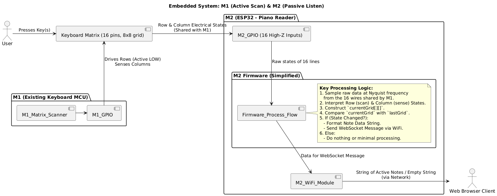
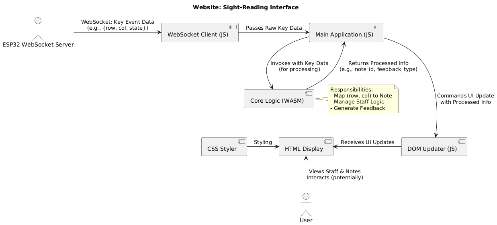
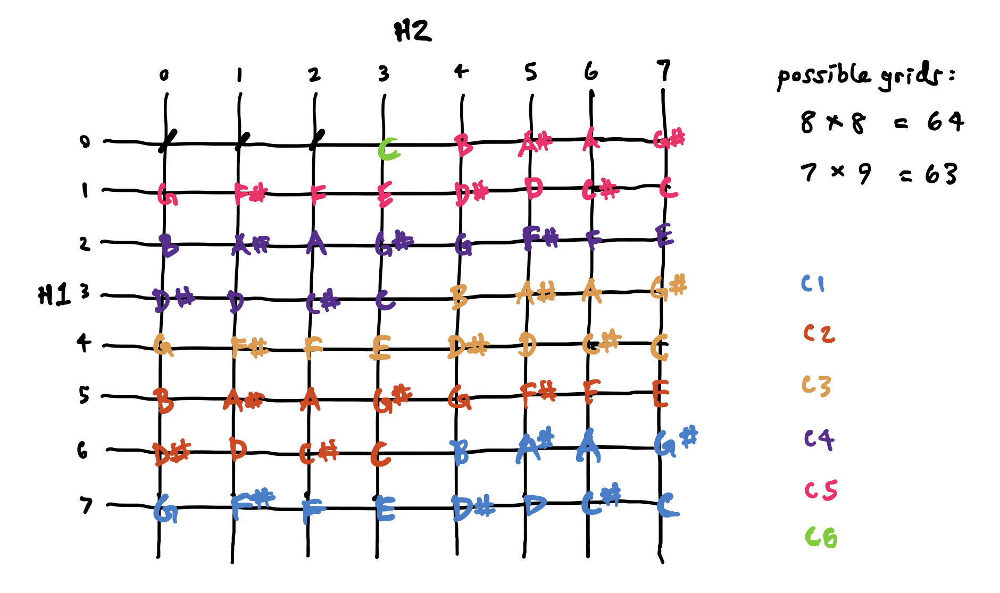
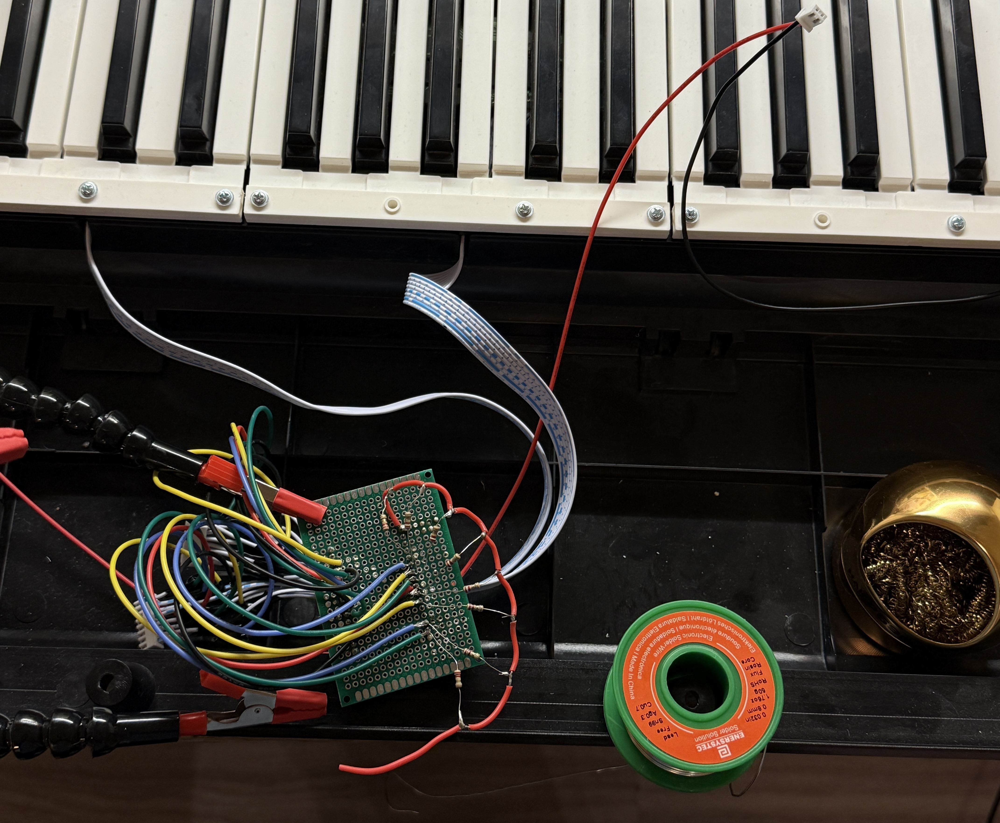

# Piano Reader: Sight-Reading Practice Tool

## Project Goal

Create an interactive sight-reading tool by modifying a digital keyboard to send key press data to a custom website, 
which will display the notes on a scrolling staff for instant feedback.

## System Overview

1.  **Embedded System:** ESP32 (M2) integrated into the keyboard to passively detect key presses from the keyboard's existing microcontroller (M1) and its matrix.

2.  **Web Application (Planned):** Browser-based interface to display notes and exercises.

## I. Embedded System: Key Detection & Transmission

### 1. Matrix Discovery & Mapping

* **Objective:** Understand the keyboard's 61-key matrix.
* **Method:** 
    * Initial programmatic discovery was hindered by electrical noise. 
    * Manual continuity testing with a DMM until pattern was established.
    * Rows (scan): 
        * Output HIGH
        * Set LOW row by row
    * Columns (sense):
        * Input pullup
        * Check col by col, if low, key is pressed
* **Findings:** An 8x8 matrix is used (64 intersections, 3 unused).

### 2. Hardware Modification & Noise Mitigation

* **Problem:** Signal leakage/ghosting causing false key detections.
* **Solution:** 
    * **2kΩ pull-up resistors** to the matrix column lines. 2kΩ gave fast rise time, but kept defined HIGH states, which helped accuracy for single and multi-press.
    * 10kΩ missed presses
    * 1kΩ allowed crosstalk

### 3. ESP32 (M2) Implementation: Passive Listening

* **Principle:** M1 (keyboard's MCU) actively scans the matrix. M2 (ESP32) passively monitors the same 8 row and 8 column lines using 16 GPIOs configured as high impedance inputs.
* **Firmware Logic:**
    1.  **Setup:** Initialize WiFi, WebSocket server, and GPIO inputs.
    2.  **Loop:**
        * Sample at Nyquist frequency for all 16 input pin states.
        * Identify the active row (driven LOW by M1).
        * Read column states for that active row to detect key presses.
        * Reconstruct the current 8x8 key grid state.
        * Compare with the previous grid state to detect changes.
        * If changes occur, map pressed keys to musical notes (using a predefined `noteGrid`) and broadcast a string of active notes (e.g., "C4 G4 E5") or an empty string via WebSockets.
        * Update the previous grid state.
* **Status:** Matrix mapped, noise addressed. ESP32 firmware for WiFi and WebSockets is ready.

## II. Web Application: Sight-Reading Interface (Planned)

### 1. Objectives

* Display a scrolling musical staff.
* Show played notes in real-time.
* Provide visual feedback.
* Allow loading of musical pieces for practice.

### 2. Stack

* **Frontend:** HTML, CSS, JavaScript (for UI, WebSocket client).
* **Core Logic (Optional):** C++ compiled to WebAssembly (WASM) for performance-critical tasks (note processing, staff logic).

### 3. Planned Development Steps

1.  **HTML/CSS:** Basic page structure and styling for staff and controls.
2.  **JS WebSocket Client:** Connect to ESP32, receive key data.
3.  **Data Processing:** (JS or JS+WASM) Map incoming data to notes, manage musical logic.
4.  **JS DOM Manipulation:** Update staff display (notes, scrolling, feedback).
5.  **Enhancements:** Score loading, tempo control, progress tracking.

## Challenges & Future Considerations

* **Hardware:** Get better at soldering. 